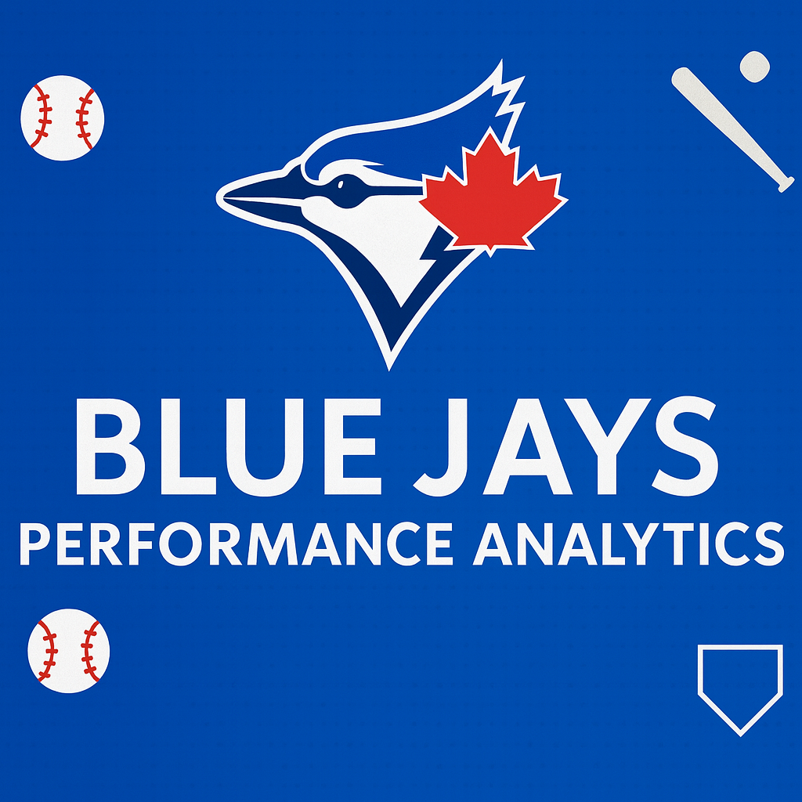
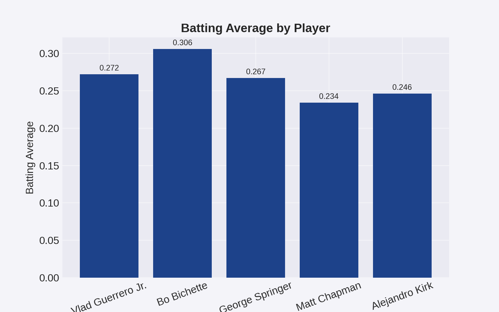
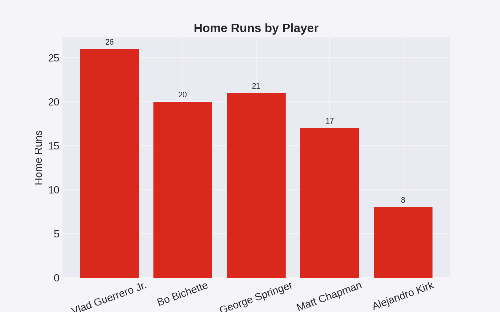
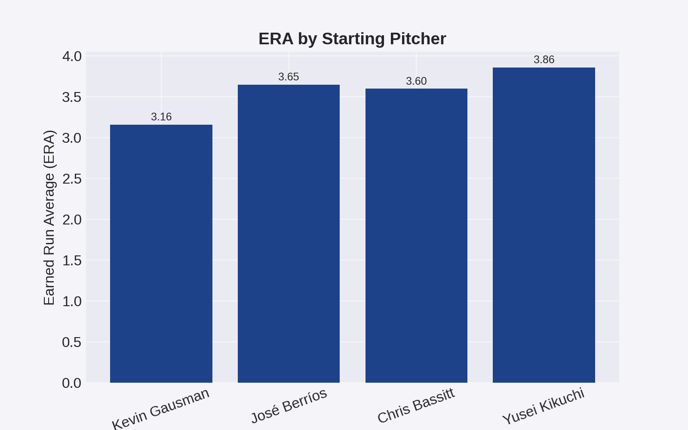
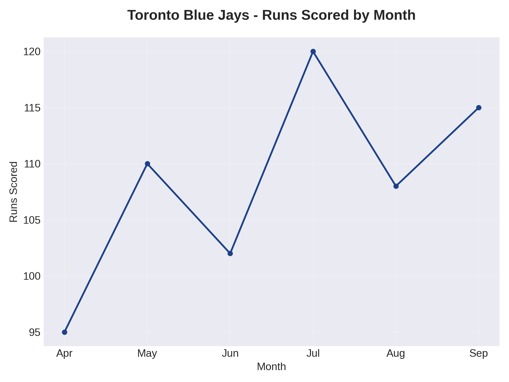
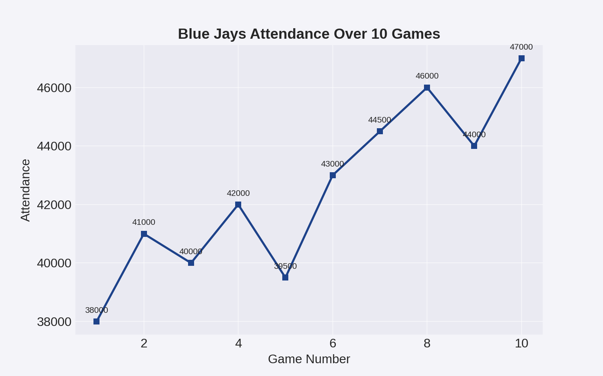
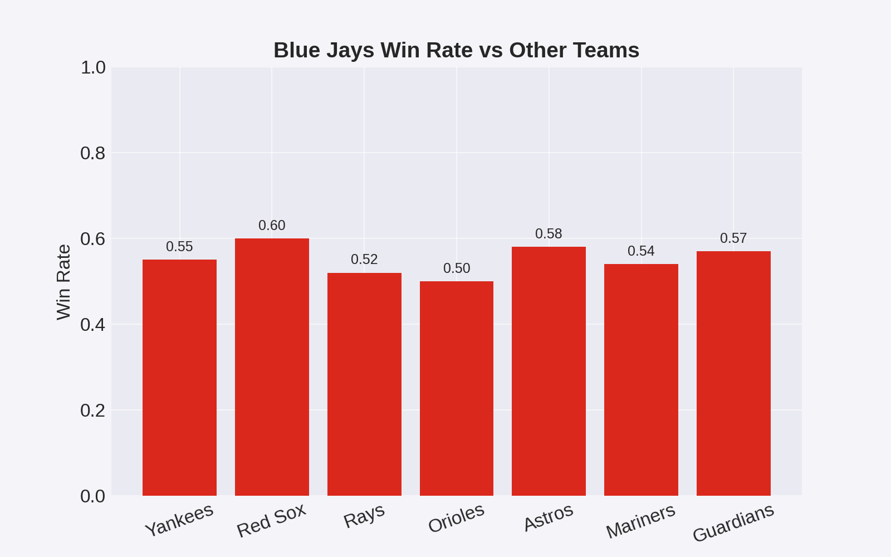

# ⚾ Blue Jays Performance Analytics

End-to-end analysis of the **Toronto Blue Jays** using **SQL + Python (pandas/matplotlib)**. This project explores player trends, bullpen strength, lineup efficiency, and game-level outcomes, and presents the findings in a clean web page (`index.html`) with exportable charts.

---

## 🎯 Objectives / Key Questions
- Which hitters are driving on-base and slugging outcomes?
- How does the rotation/bullpen perform in strikeouts and run prevention?
- Where are the peaks/troughs in run production month by month?
- How do the Jays stack up against key rivals?

---

## 🛠 Tools & Methods
- **SQL** — extract and aggregate player/game stats for season trends.
- **Python (pandas, matplotlib)** — clean data and generate visuals.
- **HTML/CSS** — polished presentation page for a recruiter-friendly view.

---

## 📊 Visuals

### Batting Average – Top Hitters


### Home Run Leaders


### Pitcher Strikeouts – Rotation & Bullpen


### Runs Scored by Month


### Attendance Trend


### Team Comparison – Division Snapshot


---

## 🔑 Highlights / Early Insights
- **Consistent contact** from top hitters correlates with monthly run spikes.
- **Strikeout leaders** in the rotation anchor late-inning win probability.
- **Monthly run production** shows a mid-season lift that aligns with lineup stability.
- **Attendance** trends mirror performance streaks and marquee series.

*(Can be expanded as deeper analysis is added.)*

---

## 📂 Project Structure  
```
blue-jays-performance-analytics/
│── assets/
│ ├── bluejays_cover.png
│ ├── chart1_batting_avg.png
│ ├── chart2_hr_leaders.png
│ ├── chart3_pitcher_strikeouts.png
│ ├── chart4_runs_by_month.png
│ ├── chart5_attendance.png
│ └── chart6_team_comparison.png
│── index.html # Showcase page with charts & summary
│── README.md # This file
│── SQL_Queries.sql # Reproducible query set
│── BlueJays_CaseStudy_MockData.xlsx
```
---

## ▶️ How to View
- Open `index.html` in this folder (or via your GitHub Pages link) to see a clean, scrollable summary with all six charts.

---

## ✨ Notes
Built from scratch (SQL ➜ Python ➜ HTML/CSS). Designed to demonstrate an **end-to-end analytics workflow** and clear storytelling for decision makers.
