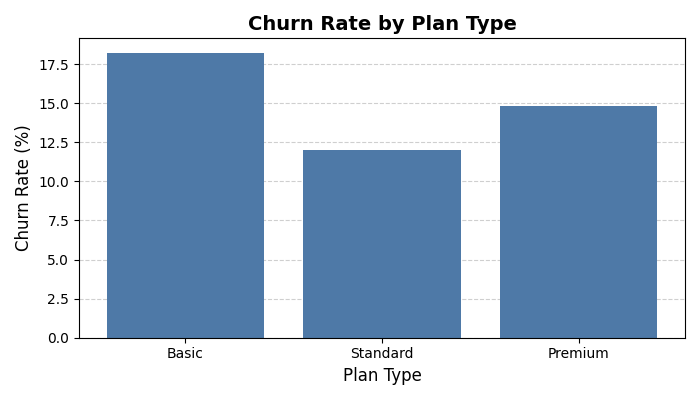

# 📉 Customer Churn Analysis

### Objective
Understand churn behavior and retention drivers by analyzing client demographics, usage cohorts, and service patterns. Provide recommendations to reduce churn and improve customer lifetime value.

---

### 🔍 Key Questions:
- Which customer segments have the highest churn rate?  
- How does churn vary across cohorts and service usage patterns?  
- What demographic or behavioral factors most strongly predict churn?  
- What interventions can improve retention?  

---

### 🛠️ Tools Used
SQL • Python (pandas) • Excel • Data Visualization • Cohort Analysis

---

### 📈 Key Insights:
- Customers on the *Basic Plan* showed the highest churn across all cohorts.  
- Complaints were strongly correlated with churn: users who filed ≥2 complaints were 3× more likely to leave.  
- Low-usage customers (<5 interactions/month) churned at significantly higher rates.  
- Recommendations include loyalty incentives, proactive complaint resolution, and tailored engagement campaigns.  

---

### 📊 Visuals

**Churn by Plan**  

**Complaints vs. Churn**  

**Usage vs. Churn**  

---

### 📂 Files Included
- `SQL_Queries.sql`: All queries used in the analysis  
- `CustomerChurn_CaseStudy_MockData.xlsx`: Simulated churn dataset  
- `/Charts`: Visuals as they would appear in SQL/Python  

---
