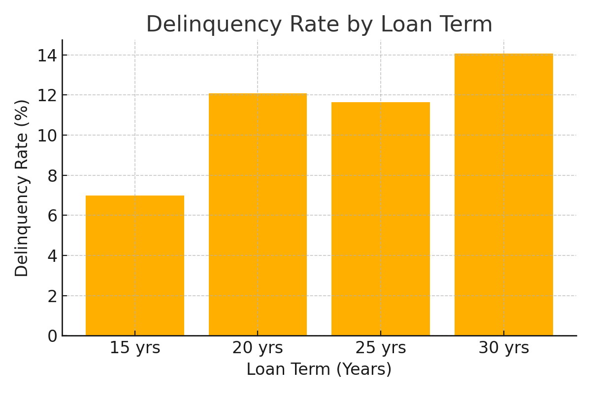
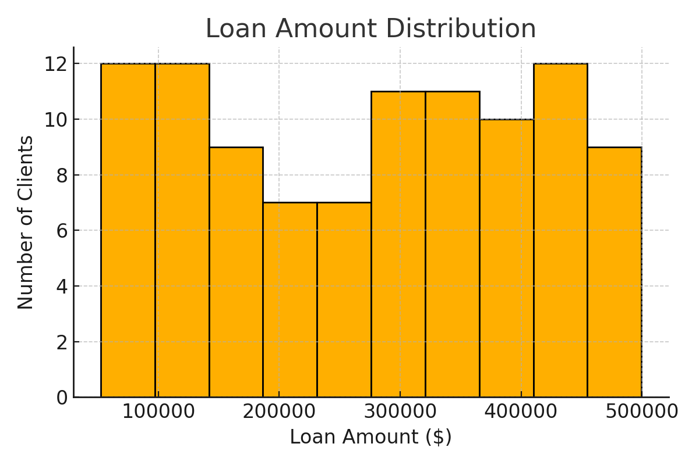
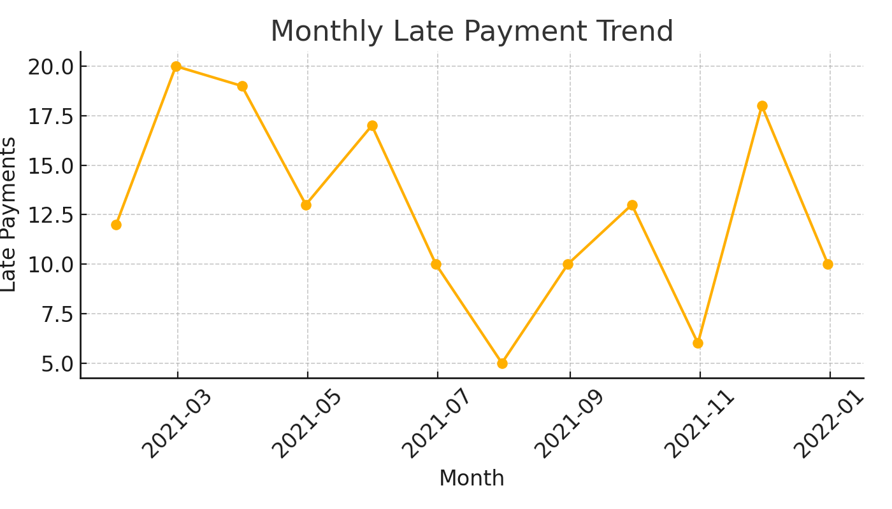

# 🏦 Mortgage Client Portfolio Analysis

### Objective
Analyze client payment behavior, delinquency trends, and loan distributions to provide insights for portfolio risk management and decision-making.

---

### 🔍 Key Questions:
- What are delinquency patterns across different loan terms?
- How are loan amounts distributed across the client base?
- What is the monthly trend of late payments?
- Which client segments are at the highest risk of delinquency?

---

### 🛠️ Tools Used
SQL • Excel • Data Visualization • Portfolio Risk Analytics

---

### 📈 Key Insights:
- Longer loan terms showed significantly higher delinquency rates.  
- Loan amounts were heavily concentrated in the \$150k–\$250k range.  
- Monthly late payments spiked in Q2 and Q4, suggesting seasonal effects.  
- Recommendations include early-warning indicators and targeted interventions for at-risk clients.  

---

### 📊 Visuals

**Delinquency by Loan Term**  

**Loan Amount Distribution**  

**Monthly Late Payments**  

---

### 📂 Files Included
- `SQL_Queries.sql`: All queries used in the analysis  
- `Mortgage_CaseStudy_MockData.xlsx`: Simulated client loan data  
- `/Charts`: Visuals as they would appear in Excel/SQL  

---
